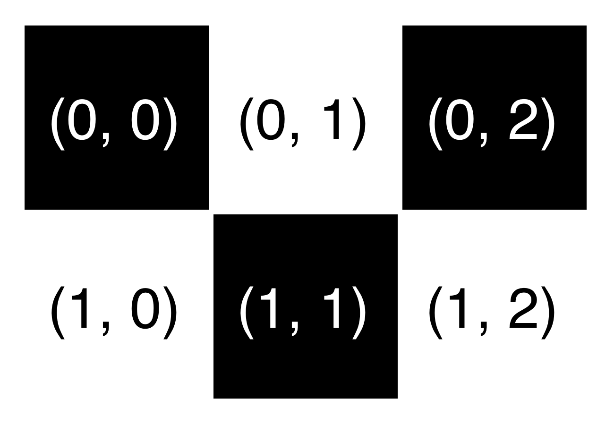
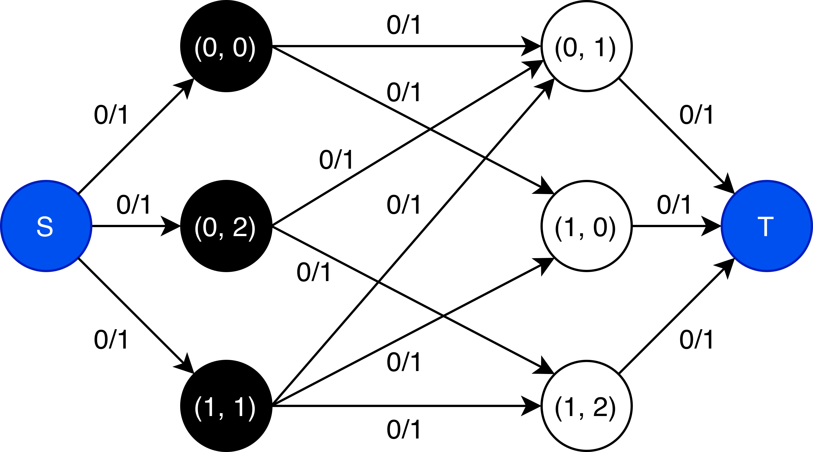
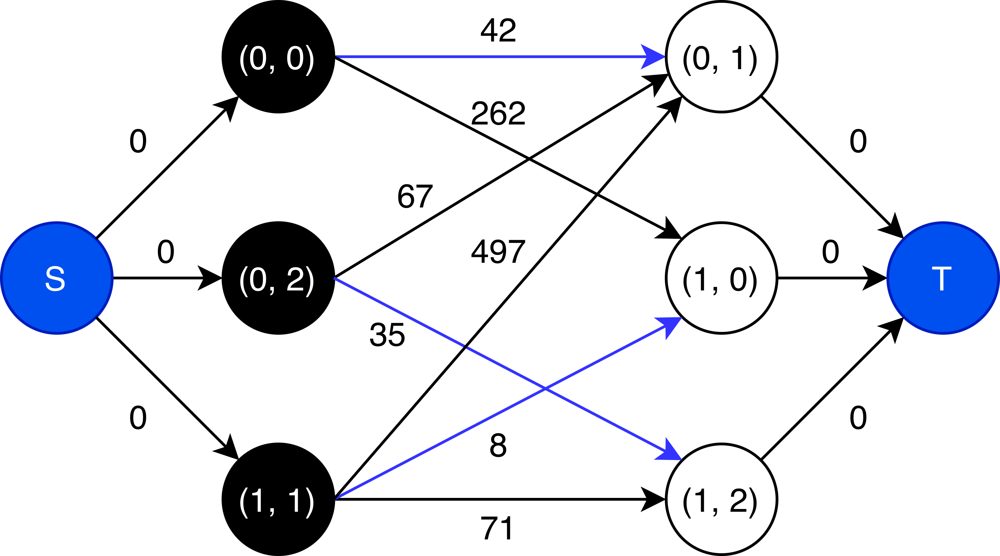
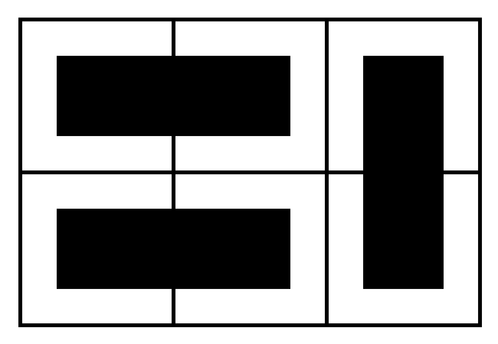

# SAT-Codierung des Logikrätsels Dominosa
Bachelor Projekt WS25/26 Dennis Hämmerle

## Random Domino Placement using Minimum Weight Perfect Matching

First the dominosa board is colored like a chessboard, splitting the cells into two disjoint sets (black and white). Adjacent pairs of black and white cells correspond to possible domino placements and are represented as edges between the two sets, forming a bipartite graph.

*Zunächst wird ein Dominobrett wie ein Schachbrett gefärbt, wodurch die Felder in zwei disjunkte Mengen (schwarz und weiß) unterteilt werden. Benachbarte Paare schwarzer und weißer Zellen entsprechen möglichen Domino Platzierungen und werden als Kanten zwischen den beiden Mengen dargestellt, wodurch ein bipartiter Graph entsteht.*

This bipartite graph is transformed into a flow network by adding a source and a sink. Each edge of the flow graph is assigned a capacity of 1. Edges from the source to the black cells and from the white cells to the sink ensure that each cell can be used at most once.

*Dieser bipartite Graph wird durch Hinzufügen einer Quelle und einer Senke in ein Flussnetzwerk umgewandelt. Jede Kante des Flussgraphen erhält dabei eine Kapazität von 1. Kanten von der Quelle zu den schwarzen Zellen und von den weißen Zellen zur Senke gewährleisten, dass jede Zelle höchstens einmal verwendet werden kann.*

Random weights are then assigned to the edges corresponding to possible domino placements. These weights ensure that a different random domino arrangement is created each time.

*Anschließend werden den Kanten, die den möglichen Domino Platzierungen entsprechen, zufällige Gewichte zugewiesen. Diese Gewichte sorgen dafür, dass jedes Mal eine andere zufällige Domino Anordnung entsteht.*

Finally, a minimum-weight perfect matching is computed on the resulting network. The selected edges form a perfect matching that covers all cells exactly once and corresponds to a valid and random domino arrangement of the original board.

*Abschließend wird auf dem resultierenden Netzwerk ein perfektes Matching mit minimalem Gewicht berechnet. Die ausgewählten Kanten bilden ein perfektes Matching, die alle Zellen genau einmal abdeckt und einer gültigen und zufälligen Domino-Anordnung des ursprünglichen Spielbretts entspricht.*

